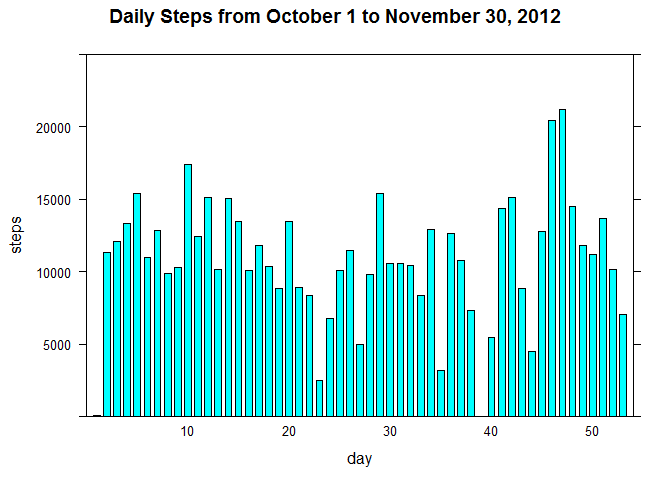
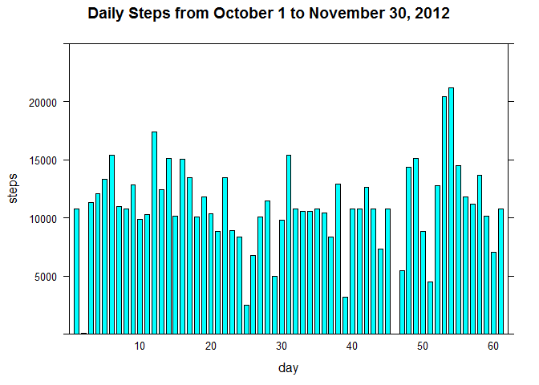

# Reproducible Research: Peer Assessment 1
Author: Kriss


## Introduction
This is the first peer assessment of Reproducible Research of JH on coursera. This assignment makes use of data from a personal activity monitoring device. This device collects data at 5 minute intervals through out the day. The data consists of two months of data from an anonymous individual collected during the months of October and November, 2012 and include the number of steps taken in 5 minute intervals each day.


### Loading and preprocessing the data
Please unzip the zip file and make sure that the "activity.csv" is in your working directory.

1. Load the data.

```r
data <- read.csv(file = "activity.csv", sep = ",", header = TRUE)
```

2. Process the data.

```r
no.na <- na.omit(data)
```


### What is mean total number of steps taken per day?

1. Make a histogram of the total number of steps taken each day.

```r
dailysteps <- aggregate(steps ~ date, no.na, sum)
library(lattice)
barchart(steps ~ date, data = dailysteps, xlab = "day", main = "Daily Steps from October 1 to November 30, 2012", xlim = c(0, 54), ylim = c(0, 25000))
```

 

2. Calculate and report the mean and median total number of steps taken per day

Here is the code to calculate the mean and median:

```r
meansteps <- mean(dailysteps$steps)
mediansteps <- median(dailysteps$steps)
```
The result is: 1.0766 &times; 10<sup>4</sup> and 10765


### What is the average daily activity pattern?

1. Make a time series plot (i.e. type = "l") of the 5-minute interval (x-axis) and the average number of steps taken, averaged across all days (y-axis)

```r
averagesteps <- aggregate(steps ~ interval, no.na, mean)
xyplot(steps ~ interval, data = averagesteps, type = "l", main = "Average across all the days")
```

 

2. Which 5-minute interval, on average across all the days in the dataset, contains the maximum number of steps?

```r
maxaverage <- which.max(averagesteps$steps)
max <- averagesteps[maxaverage, 1]
```

The maximum number of steps occur at 104e 5-minute interval, at 835.


### Imputing missing values
Note that there are a number of days/intervals where there are missing values (coded as NA). The presence of missing days may introduce bias into some calculations or summaries of the data.

1. Calculate and report the total number of missing values in the dataset (i.e. the total number of rows with NAs)

```r
narows <- nrow(data) - nrow(no.na)
```

The total number of missing values in the dataset: 2304 rows.


2. Fill the means of 5-minute interval accordingly in all of the missing values in the dataset and create a new one.

```r
a <- aggregate(steps ~ interval, data, mean, na.action = na.omit)
m <- merge(data, a, by.x = "interval", by.y = "interval")
m <- m[order(m$date),]
nas <- subset(m, is.na(m$steps.x))
m$steps.x[is.na(m$steps.x)] <- nas$steps.y
newdata <- data.frame(steps = m$steps.x, date = m$date, interval = m$interval)
```
3. Make a histogram of the total number of steps taken each day with the new dataset.

```r
newsteps <- aggregate(steps ~ date, newdata, sum)
barchart(steps ~ date, data = newsteps, xlab = "day", main = "Daily Steps from October 1 to November 30, 2012", xlim = c(0, 62), ylim = c(0, 25000))
```

 

4. Calculate and report the mean and median total number of steps taken per day with the new dataset.

```r
newmean <- mean(newsteps$steps)
newmedian <- median(newsteps$steps)
```
The result is: 1.0766 &times; 10<sup>4</sup> and 1.0766 &times; 10<sup>4</sup>

The mean values are same, but the median values have 1 step difference between the new and old dataset. After imputing missing data, it is easier to estimate everyday steps pattern by the plot. We can see that it's around 10,000 steps per day.


### Are there differences in activity patterns between weekdays and weekends?

1. With the new dataset, create a new factor variable with two levels  indicating whether a given date is a weekday or weekend day.

```r
### Set time language as English in case that someone uses other version computer system than English.
Sys.setlocale("LC_TIME", "English")
```

```
## [1] "English_United States.1252"
```

```r
### Add a new column with two factors - weekday and weekend.
newdata$weekdays <- weekdays(as.Date(newdata$date))
weekday <- c("Monday", "Tuesday", "Wednesday", "Thursday", "Friday")
weekend <- c("Saturday", "Sunday")
newdata[which(newdata$weekdays %in% weekday), 4] <- "weekday"
newdata[which(newdata$weekdays %in% weekend), 4] <- "weekend"
```

2. Make a panel plot containing a time series plot (i.e. type = "l") of the 5-minute interval (x-axis) and the average number of steps taken, averaged across all weekday days or weekend days (y-axis).

```r
### Calculate seperately average number of steps taken across all weekday days or weekend days.
weekdayaverage <- aggregate(steps ~ interval, newdata[which(newdata$weekdays == "weekday"), ], mean)
weekendaverage <- aggregate(steps ~ interval, newdata[which(newdata$weekdays == "weekend"), ], mean)
wda <- cbind(weekdayaverage, weekdays = rep("weekday", length(weekdayaverage$steps)))
wea <- cbind(weekendaverage, weekdays = rep("weekend", length(weekendaverage$steps)))
### Combine the two average datasets
weekaverage <- rbind(wda,wea)
xyplot(steps ~ interval | weekdays, data = weekaverage, type = "l", ylab = "Number of steps", main = "Activity patterns of weekdays and weekends", layout = c(1, 2))
```

 

From the plot, we can oberve that the number of steps is distributed more regularly on weekends than on weekdays.
